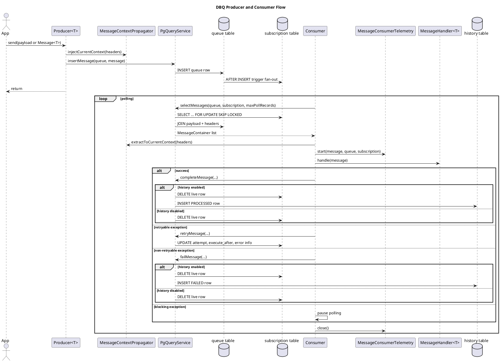
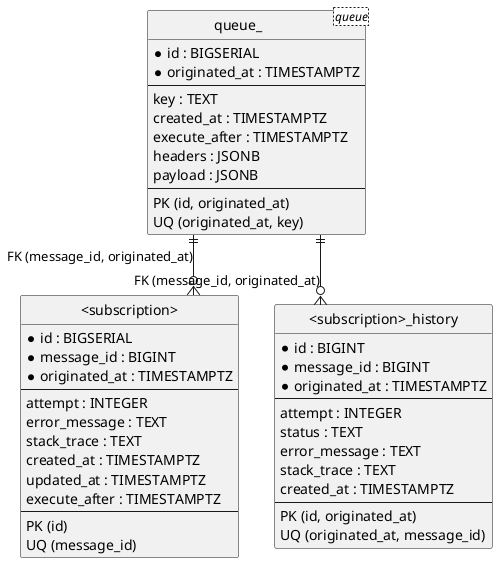

# DBQ Documentation

## 1. Product Idea

DBQ is a database-backed queue for applications that want:

- transactional message publishing in the same database as business data
- several independent subscriptions for one logical queue
- simple operational model without a separate broker
- explicit retention based on PostgreSQL partitions

The core idea is:

1. producer writes one record into a queue table
2. each subscription receives its own live processing row
3. consumer works only with its subscription state
4. processed or failed records can optionally be moved to history
5. old queue and history data is removed by retention rules

This model is close to transactional outbox, but DBQ also includes subscription fan-out, retry handling, optional history, and partition lifecycle.

## 2. Design Principles

- DB is the source of truth for both publishing and consumption state.
- Queue data is shared by all subscriptions.
- Subscription progress is isolated per subscription.
- Message delivery is pull-based, not push-based.
- Retention is explicit and partition-based.
- Infrastructure integration is separated through SPI interfaces.
- Observability context is propagated through message headers, not through payload fields.

## 3. Main Concepts

### Queue

Logical stream of messages, identified by `QueueName`.

- one queue has one main queue table
- one queue may have many subscriptions
- queue has retentio

### Subscription

Independent consumer state, identified by `SubscriptionId`.

- every subscription has its own live table
- every subscription may optionally have its own history table
- the same message can be processed differently by different subscriptions

### Message

Public carrier object:

- `key` - caller-defined deduplication key
- `originatedTime` - logical event time and partition key
- `payload` - business object stored as JSONB
- `headers` - transport metadata, for example tracing headers

### QueueManager

High-level runtime facade over:

- `QueryService`
- `TransactionService`
- `TableManager`
- `MessageFactory`

It owns:

- queue registration
- producer registration
- consumer registration
- starting and stopping consumer threads

## 4. Public API

Main public types:

- `QueueManager`
- `QueueConfig`
- `ProducerConfig`
- `ConsumerConfig`
- `Producer<T>`
- `Message<T>`
- `MessageHandler<T>`
- `QueueName`
- `SubscriptionId`
- policy interfaces in `org.pak.dbq.api.policy`

### Queue registration

Queue must be registered before producer or consumer registration.

Relevant settings:

- `QueueConfig.Properties.retentionDays`
- `QueueManager.Properties.autoDdl`

`retentionDays` is a queue property.

`autoDdl` is an infrastructure/runtime property of `QueueManager`. It controls whether `QueueManager` asks `TableManager` to auto-create queue and subscription tables.

### Producer API

Producer registration:

```java
Producer<OrderCreated> producer = queueManager.registerProducer(
        ProducerConfig.<OrderCreated>builder()
                .queueName(new QueueName("orders"))
                .clazz(OrderCreated.class)
                .build()
);
```

Publishing:

```java
producer.send(new OrderCreated("order-1"));

producer.send(new Message<>(
        "order-1",
        Instant.now(),
        new OrderCreated("order-1"),
        Map.of("tenant", "acme")
));
```

### Consumer API

Consumer registration:

```java
queueManager.registerConsumer(
        ConsumerConfig.<OrderCreated>builder()
                .queueName(new QueueName("orders"))
                .subscriptionId(new SubscriptionId("billing"))
                .messageHandler(message -> {
                    OrderCreated payload = message.payload();
                })
                .properties(ConsumerConfig.Properties.builder()
                        .concurrency(4)
                        .maxPollRecords(10)
                        .historyEnabled(true)
                        .build())
                .build()
);
```

Defaults:

- `concurrency = 1`
- `maxPollRecords = 1`
- `persistenceExceptionPause = 30s`
- `unpredictedExceptionPause = 30s`
- `historyEnabled = false`

Default policies:

- `SimpleRetryablePolicy`
- `SimpleNonRetryablePolicy`
- `SimpleBlockingPolicy`

Current default behavior:

- every handler exception is retryable by default
- nothing is blocking by default
- nothing is non-retryable by default

So to make an exception blocking or terminal, caller must provide custom policy implementations.

## 5. Runtime Flow

### Producer flow

1. client calls `Producer.send(...)`
2. `MessageContextPropagator` injects current transport context into headers
3. `QueryService.insertMessage(...)` inserts row into queue table
4. PostgreSQL trigger copies queue row into each subscription live table

### Consumer flow

1. `QueueManager.startConsumers()` starts `ConsumerStarter`
2. `ConsumerStarter` creates `concurrency` worker threads
3. each worker runs polling loop inside `TransactionService.inTransaction(...)`
4. `QueryService.selectMessages(...)` locks live subscription rows with `FOR UPDATE SKIP LOCKED`
5. payload and headers are reconstructed into `Message<T>`
6. `MessageContextPropagator` extracts headers into current execution context
7. `MessageConsumerTelemetry` opens processing scope
8. `MessageHandler.handle(...)` runs
9. after handler:
   - success -> `completeMessage(...)`
   - retryable error -> `retryMessage(...)`
   - non-retryable error -> `failMessage(...)`
   - blocking error -> consumer pauses

## 6. Table Model

DBQ uses three table kinds.

### 6.1 Queue table

One per queue.

Example name:

- queue `orders` -> table `orders`

Columns:

- `id BIGSERIAL`
- `key TEXT`
- `created_at TIMESTAMPTZ NOT NULL DEFAULT CURRENT_TIMESTAMP`
- `execute_after TIMESTAMPTZ NOT NULL DEFAULT CURRENT_TIMESTAMP`
- `originated_at TIMESTAMPTZ NOT NULL`
- `headers JSONB NOT NULL DEFAULT '{}'::jsonb`
- `payload JSONB NOT NULL`

Primary key:

- `(id, originated_at)`

Indexes:

- `created_at`
- unique `(originated_at, key)`

Notes:

- queue table is partitioned by `originated_at`
- uniqueness is not global by key alone
- deduplication key is the pair `(originated_at, key)`

### 6.2 Subscription live table

One per subscription.

Example name:

- subscription `billing` -> table `billing`

Columns:

- `id BIGSERIAL PRIMARY KEY`
- `message_id BIGINT NOT NULL`
- `attempt INTEGER NOT NULL DEFAULT 0`
- `error_message TEXT`
- `stack_trace TEXT`
- `created_at TIMESTAMPTZ NOT NULL DEFAULT CURRENT_TIMESTAMP`
- `updated_at TIMESTAMPTZ`
- `originated_at TIMESTAMPTZ NOT NULL`
- `execute_after TIMESTAMPTZ NOT NULL DEFAULT CURRENT_TIMESTAMP`

Foreign key:

- `(message_id, originated_at)` -> queue table `(id, originated_at)`

Indexes:

- unique `message_id`
- `created_at`
- `execute_after`

Purpose:

- keeps only live processing state for one subscription
- is the table consumers poll from
- is not partitioned

### 6.3 Subscription history table

Optional. One per subscription if `historyEnabled = true`.

Example name:

- subscription `billing` -> table `billing_history`

Columns:

- `id BIGINT`
- `message_id BIGINT NOT NULL`
- `attempt INTEGER NOT NULL DEFAULT 0`
- `status TEXT NOT NULL DEFAULT 'PROCESSED'`
- `error_message TEXT`
- `stack_trace TEXT`
- `created_at TIMESTAMPTZ NOT NULL DEFAULT CURRENT_TIMESTAMP`
- `originated_at TIMESTAMPTZ NOT NULL`

Foreign key:

- `(message_id, originated_at)` -> queue table `(id, originated_at)`

Primary key:

- `(id, originated_at)`

Indexes:

- unique `(originated_at, message_id)`
- `created_at`

Purpose:

- stores terminal processing outcome per subscription
- receives rows on `completeMessage(...)` and `failMessage(...)`
- is partitioned by `originated_at`

## 7. Relationships Between Tables

The queue table is the shared source table.

For every inserted queue row:

- each subscription trigger inserts one row into its live subscription table
- all subscriptions point back to the same queue row

Terminal states:

- if history is disabled:
  - success deletes row from subscription live table
  - failure deletes row from subscription live table
- if history is enabled:
  - success moves row from subscription live table to subscription history table with status `PROCESSED`
  - failure moves row from subscription live table to subscription history table with status `FAILED`

## 8. Partitioning and Retention

### Queue partitions

- queue table is range-partitioned by UTC day
- partition boundaries are always UTC
- partition name format: `<table>_yyyy_MM_dd`

### History partitions

- history table is also range-partitioned by UTC day
- only exists when history is enabled for that subscription

### Self-healing partition creation

`PgQueryService` ensures required partitions before write operations:

- queue partition before message insert
- history partition before complete/fail when history is enabled

Creation is protected by `pg_advisory_xact_lock(...)`.

After creation DBQ validates actual partition bounds. If an existing partition with the same name has a wrong range, DBQ fails fast instead of silently writing into a corrupted partition layout.

### Retention cleanup

`PgTableManager.cleanPartitions()` removes old partitions in this order:

1. old history partitions
2. old queue partitions

This order matters because history tables may still reference queue partitions through foreign keys.

`subscription` live tables are not partitioned and are not dropped by retention cleanup.

## 9. Auto DDL

`QueueManager.Properties.autoDdl` enables idempotent table creation through `TableManager`.

When enabled:

- queue registration can create the queue parent table
- consumer registration can create the subscription parent table
- existing tables do not cause an error because DDL uses `IF NOT EXISTS`

Auto DDL is infrastructure convenience, not a migration framework replacement. Production setups will often still prefer explicit SQL migrations.

## 10. Extension Points

DBQ is intentionally split into API and SPI.

### 10.1 Policies

Public extension points:

- `RetryablePolicy`
- `NonRetryablePolicy`
- `BlockingPolicy`

Use them when you want custom classification of handler exceptions.

### 10.2 Message context propagation

SPI:

- `MessageContextPropagator`

Use it when you want to:

- inject tracing headers during publish
- restore tracing or logging context during consume

Example implementation already exists:

- `OpenTelemetryMessageContextPropagator`

### 10.3 Consumer telemetry

SPI:

- `MessageConsumerTelemetry`

Use it when you want:

- processing spans
- custom metrics
- audit hooks around message handling

Example implementation already exists:

- `OpenTelemetryMessageConsumerTelemetry`

### 10.4 Message creation

SPI:

- `MessageFactory`

Use it when you want to control:

- message instantiation
- custom subclasses or wrappers
- specialized deserialization behavior

### 10.5 Persistence and transactions

SPI:

- `PersistenceService`
- `TransactionService`

Use them when you want to integrate DBQ with:

- another JDBC abstraction
- another transaction framework
- a custom infrastructure layer

Current default integration:

- `SpringPersistenceService`
- `SpringTransactionService`

### 10.6 Storage implementation

SPI:

- `QueryService`
- `TableManager`

Use them when you want a new backend or a different SQL strategy.

To build another storage implementation you need to provide:

- message insert with deduplication
- polling with row locking and skip-locked semantics or an equivalent safety model
- retry scheduling by updating next execution time
- terminal completion and failure handling
- optional history persistence
- queue and history retention handling
- optional auto-DDL behavior if you want to support it

In practice this means `QueryService` is the main storage contract, and `TableManager` is the storage-maintenance contract.

## 11. Producer / Consumer Interaction Diagram



## 12. ER Diagram



## 13. What Is Required To Extend DBQ

### Add custom retry logic

Need:

- custom `RetryablePolicy`
- optionally custom `NonRetryablePolicy`
- optionally custom `BlockingPolicy`

### Add tracing / correlation

Need:

- `MessageContextPropagator`
- optionally `MessageConsumerTelemetry`

### Add another framework integration

Need:

- `PersistenceService`
- `TransactionService`

### Add another storage backend

Need:

- `QueryService`
- `TableManager`
- storage-specific serialization strategy for payload and headers

### Keep PostgreSQL but customize message representation

Need:

- `MessageFactory`
- matching JSONB registration in `JsonbConverter`

## 14. Operational Notes

- Queue names and subscription ids allow lowercase letters and `-`.
- Schema names allow lowercase letters and `_`.
- Queue and history partitioning is UTC-based.
- `historyEnabled` is a subscription-level runtime feature and must match the created schema.
- If history is disabled, terminal results are not stored anywhere after deletion from the live subscription table.
- If auto DDL is disabled, parent tables must exist before registration and work must still rely on `PgQueryService` self-healing partition creation for daily partitions.

